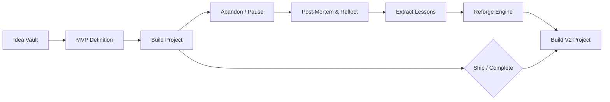

# Reforge

> *"Most tools help you manage what you're building. Reforge helps you learn from everything you've built."*

Reforge is a builder-focused project memory and resurrection system for solo developers, indie hackers, student builders, and hackathon participants. Instead of treating projects merely as "active tasks" or "closed tickets", Reforge treats an idea, its execution journey, the reasons it was paused or abandoned, the post-mortem lessons learned, and its subsequent resurrection (V2) as a unified, continuous engineering lifecycle.

---

## 🔄 The Reforge Lifecycle



Valuable engineering context and product insights are usually lost when side projects stall. Reforge transforms abandoned repos and half-finished experiments into structured, reusable engineering knowledge.

---

## 🛠 Tech Stack

| Layer | Technology | Rationale |
| :--- | :--- | :--- |
| **Frontend Client** | [Flutter](https://flutter.dev) (Dart 3.x) | Cross-platform (Android-first, Web demo, iOS-ready), rich UI, native performance |
| **State Management** | [Riverpod](https://riverpod.dev) | Compile-safe dependency injection, testability, reactive state |
| **Backend & Auth** | [Supabase](https://supabase.com) | Managed Postgres, built-in Auth, Storage, instant Realtime |
| **Database** | [PostgreSQL](https://www.postgresql.org) | Relational lineage modeling, foreign key integrity, Row-Level Security (RLS) |
| **Serverless Logic** | Supabase Edge Functions (Deno / TS) | Privileged workflows, atomic transactions, secret isolation |
| **AI Gateway** | Edge Functions → LLM Provider | Advisory MVP suggestions, post-mortem synthesis, V2 scaffolding |

---

## 📚 Project Documentation System

This repository maintains comprehensive, single-source-of-truth documentation for all product, architecture, design, and engineering guidelines:

| Document | Description |
| :--- | :--- |
| 📄 [**Project Requirement Document**](file:///home/arefin-raihan/Desktop/Flutter%20Projects/reforge/project%20requirement%20document.md) | Full PRD: problem statements, user personas, functional/non-functional requirements, business rules, edge cases, and MVP scope. |
| 🏗 [**Architecture Design**](file:///home/arefin-raihan/Desktop/Flutter%20Projects/reforge/architechture.md) | System architecture, modular directory layout, data flows, database schema, RLS policies, RPC endpoints, and ADRs. |
| 📏 [**Development & AI Rules**](file:///home/arefin-raihan/Desktop/Flutter%20Projects/reforge/rules.md) | Coding conventions, strict architectural constraints, AI coding-agent directives, security protocols, and Git workflows. |
| 🎨 [**Design System & UI/UX**](file:///home/arefin-raihan/Desktop/Flutter%20Projects/reforge/design.md) | Visual identity, color palette, typography hierarchy, spacing scale, component specifications, and wireframe layouts. |
| ✅ [**Task Tracking & Roadmap**](file:///home/arefin-raihan/Desktop/Flutter%20Projects/reforge/task.md) | Phased implementation roadmap (A1–A8), granular task checklist, prerequisites, and Definitions of Done. |
| 🧠 [**Project Memory & Context**](file:///home/arefin-raihan/Desktop/Flutter%20Projects/reforge/memory.md) | Living project memory, technical decision log, hypothesis validation status, and changelog. |

---

## 🚀 Key Product Features

1. **Idea Vault**: Quick-capture ideas in under two minutes with problem definition, target user tagging, and progressive enrichment.
2. **MVP Boundary Definition**: Define strict scope boundaries before starting execution to combat scope creep.
3. **Project Workspace & Memory**: Track active tasks, document decisions in real-time, and log blockers and architectural rationales as you build.
4. **Deliberate Abandonment Workflow**: Make stopping a project an intentional, guilt-free lifecycle transition rather than silent decay.
5. **Project Graveyard**: Dedicated memorial for paused and abandoned projects preserving all contextual history.
6. **Structured Post-Mortem**: Guided reflection capturing what went wrong, what went well, root causes, and reusable engineering lessons.
7. **Reforge Engine (Resurrection to V2)**: Seamlessly spawn a linked V2 project seeded with lessons and architectural context from the original project.
8. **Advisory AI Assistance**: Edge-function powered idea scope evaluation, post-mortem summarization, and resurrection roadmaps without treating AI as the system of record.

---

## 📂 Repository Layout

```text
reforge/
├── lib/
│   ├── app/                      # App entrypoint, routing, global providers
│   ├── core/                     # Shared themes, design tokens, errors, network clients
│   │   ├── errors/
│   │   ├── theme/
│   │   ├── utils/
│   │   └── widgets/
│   └── features/                 # Feature-driven modular architecture
│       ├── auth/                 # Authentication & user profile
│       ├── ideas/                # Idea Vault CRUD & tagging
│       ├── projects/             # Active projects, tasks & workspace memory
│       ├── graveyard/            # Graveyard surface & project archive
│       ├── postmortem/           # Post-mortem capture & lesson extraction
│       ├── reforge/              # V2 resurrection engine & lineage linking
│       ├── search/               # Global search & filtering
│       └── profile/              # User settings & preferences
├── test/                         # Unit and widget tests
├── integration_test/             # End-to-end lifecycle integration tests
├── supabase/
│   ├── migrations/               # PostgreSQL schema versions & RLS policies
│   └── functions/                # Deno Edge Functions (AI Gateway & RPCs)
└── assets/                       # Icons, illustrations, and brand assets
```

---

## 🏁 Getting Started

### Prerequisites
- [Flutter SDK](https://docs.flutter.dev/get-started/install) (`^3.13.1` or later)
- [Dart SDK](https://dart.dev/get-dart)
- [Supabase CLI](https://supabase.com/docs/guides/cli) for local backend emulation
- Docker (required by Supabase CLI for local PostgreSQL)

### Local Setup

1. **Clone the repository:**
   ```bash
   git clone https://github.com/your-username/reforge.git
   cd reforge
   ```

2. **Install Flutter dependencies:**
   ```bash
   flutter pub get
   ```

3. **Start local Supabase stack:**
   ```bash
   supabase start
   supabase db reset # Applies migrations from supabase/migrations
   ```

4. **Configure Environment Variables:**
   Copy the example environment configuration and supply your Supabase local or cloud credentials:
   ```bash
   cp .env.example .env
   ```
   Add your `SUPABASE_URL` and `SUPABASE_ANON_KEY`. *Never commit service-role keys or AI API secrets to the client.*

5. **Run the Flutter application:**
   ```bash
   # Android
   flutter run -d android

   # Web Demo
   flutter run -d chrome
   ```

6. **Execute Tests:**
   ```bash
   # Run static analysis
   flutter analyze

   # Run unit and widget tests
   flutter test

   # Run integration tests
   flutter test integration_test/lifecycle_test.dart
   ```

---


## 📄 License

Reforge is licensed under the MIT License.
