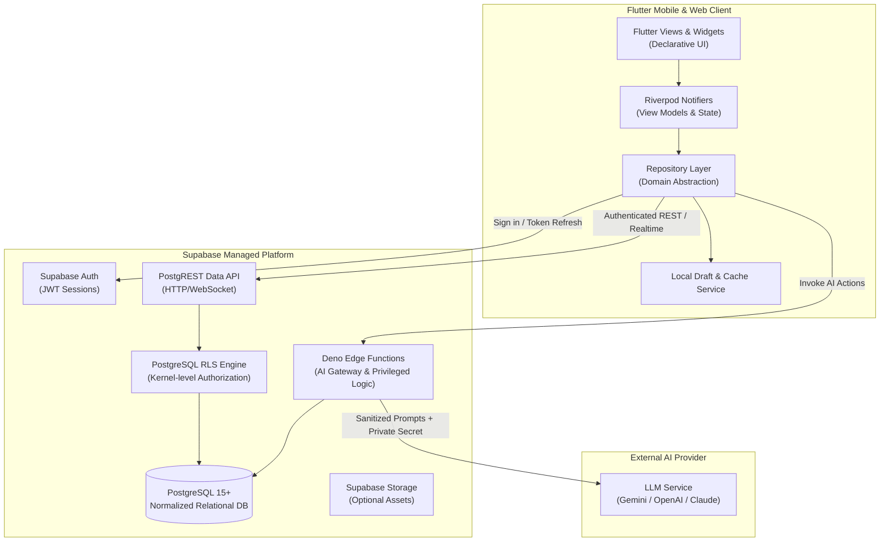
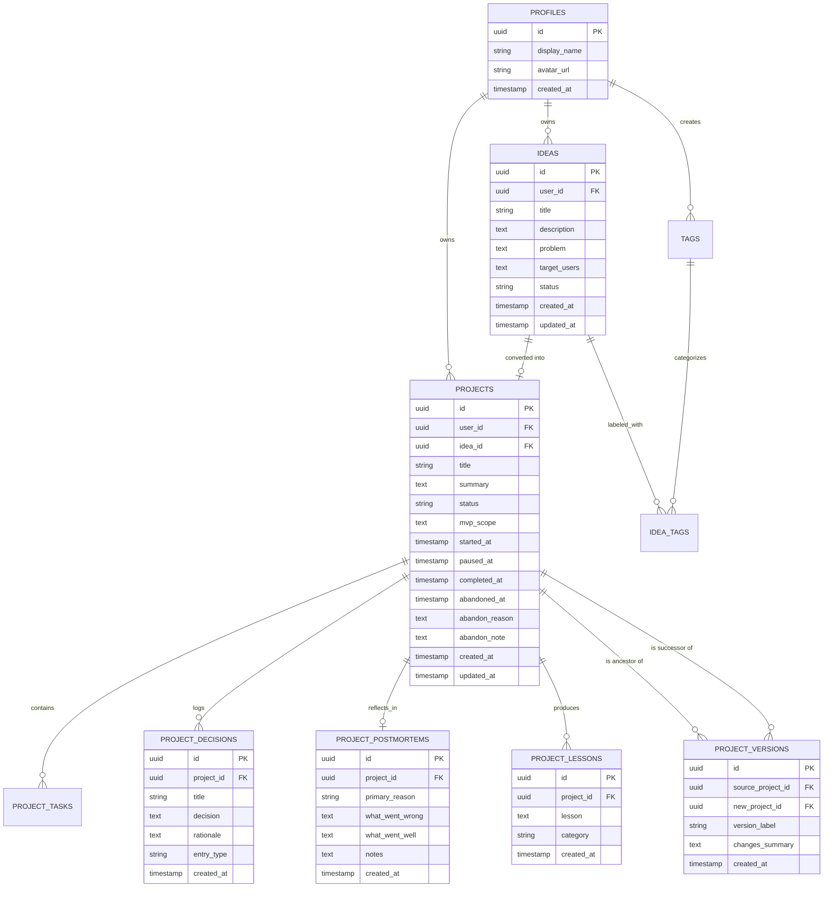

# Reforge — System & Software Architecture Document

**Document Version:** 1.0  
**Date:** September 2026  
**Pattern:** Feature-Driven Modular Monolith + Managed Backend Services  
**Client:** Flutter (Dart 3.x) with Riverpod State Management  
**Backend:** Supabase (PostgreSQL, Supabase Auth, Storage, Deno Edge Functions)

---

## 1. Architectural Goals & Design Philosophy

The architecture of Reforge is engineered to deliver:
1. **Rapid Time-to-Market:** Leverage Supabase's managed primitives (Auth, Postgres, Realtime, Edge Functions) to eliminate boilerplate custom microservices.
2. **Strict Data Isolation:** Guarantee multi-tenant security via PostgreSQL Row-Level Security (RLS) directly at the database engine level.
3. **Decoupled Feature Modularity:** Organize code by business domain features rather than horizontal technical silos.
4. **Predictable State Flow:** Unidirectional data flow and immutable state handling via Flutter Riverpod.
5. **AI as an Advisory Gateway:** Decouple AI intelligence into serverless Edge Functions to protect API secrets and enforce rate limits, ensuring AI never becomes a single point of product failure.

---

## 2. High-Level System Architecture



---

## 3. Client-Side Architecture (Flutter + Riverpod)

The Flutter application adheres to clean separation of concerns:

```text
┌────────────────────────────────────────────────────────┐
│                   Presentation Layer                   │
│        (Screens, Modals, Responsive Components)        │
└───────────────────────────▲────────────────────────────┘
                            │ Watches State / Emits Intent
┌───────────────────────────┴────────────────────────────┐
│                    Application Layer                   │
│           (Riverpod Notifiers, State / AsyncValue)     │
└───────────────────────────▲────────────────────────────┘
                            │ Calls Domain Methods
┌───────────────────────────┴────────────────────────────┐
│                    Repository Layer                    │
│   (Data Abstraction, DTO Mapping, Error Normalization) │
└───────────────────────────▲────────────────────────────┘
                            │ Network / Storage
┌───────────────────────────┴────────────────────────────┐
│                   Data Source Layer                    │
│  (Supabase Client, Local SharedPrefs / SecureStorage)  │
└────────────────────────────────────────────────────────┘
```

### Key Client Rules:
* **No Direct Backend Calls in Widgets:** Presentation widgets must never instantiate or call `Supabase.instance.client` directly.
* **Immutability:** All UI state models use `@freezed` or standard immutable data classes.
* **Unified Failure Modeling:** Low-level HTTP or PostgreSQL errors are trapped in Repositories and transformed into typed `AppFailure` domain classes before reaching ViewModels.

---

## 4. Codebase Directory Organization

```text
reforge/
├── lib/
│   ├── app/
│   │   ├── app.dart                   # MaterialApp.router configuration
│   │   ├── routes.dart                # GoRouter route declarations
│   │   └── observers.dart             # Riverpod & navigation observers
│   ├── core/
│   │   ├── constants/                 # Spacing, dimensions, system strings
│   │   ├── errors/                    # AppFailure, Exceptions, Error Handler
│   │   ├── network/                   # SupabaseClient provider, interceptors
│   │   ├── theme/                     # ReforgeTheme, ColorPalette, Typography
│   │   └── widgets/                   # Common buttons, cards, text fields, loaders
│   └── features/
│       ├── auth/
│       │   ├── data/                  # AuthRepository, SupabaseAuthDataSource
│       │   ├── presentation/          # LoginScreen, RegisterScreen, AuthNotifier
│       │   └── models/                # UserProfile model
│       ├── ideas/
│       │   ├── data/                  # IdeasRepository
│       │   ├── presentation/          # IdeaVaultScreen, IdeaDetailScreen, IdeaForm
│       │   └── models/                # Idea, Tag models
│       ├── projects/
│       │   ├── data/                  # ProjectsRepository, TasksRepository
│       │   ├── presentation/          # ProjectWorkspaceScreen, MemoryTimelineScreen
│       │   └── models/                # Project, ProjectTask, ProjectDecision
│       ├── graveyard/
│       │   ├── data/                  # GraveyardRepository
│       │   ├── presentation/          # GraveyardScreen, AbandonDialog
│       │   └── models/                # GraveyardItem model
│       ├── postmortem/
│       │   ├── data/                  # PostmortemRepository
│       │   ├── presentation/          # PostmortemScreen, LessonTagSelector
│       │   └── models/                # Postmortem, ProjectLesson
│       ├── reforge/
│       │   ├── data/                  # ReforgeRepository
│       │   ├── presentation/          # ReforgeWizardScreen, V2SummaryScreen
│       │   └── models/                # ProjectVersion lineage model
│       ├── search/
│       │   ├── presentation/          # GlobalSearchScreen, SearchFilterBar
│       │   └── providers/             # SearchNotifier
│       └── profile/
│           ├── presentation/          # ProfileScreen, SettingsScreen
│           └── providers/             # UserPreferencesNotifier
├── supabase/
│   ├── migrations/
│   │   ├── 20260926000001_create_profiles.sql
│   │   ├── 20260926000002_create_ideas_and_tags.sql
│   │   ├── 20260926000003_create_projects_and_tasks.sql
│   │   ├── 20260926000004_create_memory_and_postmortems.sql
│   │   ├── 20260926000005_create_project_lineage.sql
│   │   └── 20260926000006_rpc_functions.sql
│   └── functions/
│       ├── ai_idea_review/
│       ├── ai_postmortem/
│       └── ai_reforge/
├── test/                              # Unit & Widget tests
└── integration_test/                  # E2E Lifecycle flows
```

---

## 5. Database Schema & Data Modeling

The PostgreSQL schema enforces strict referential integrity, cascading behavior, and database-level constraints.



### Table Definitions & Constraints

#### 1. `profiles`
* `id` UUID PRIMARY KEY REFERENCES `auth.users(id)` ON DELETE CASCADE
* `display_name` TEXT NOT NULL
* `avatar_url` TEXT
* `created_at` TIMESTAMPTZ DEFAULT NOW()

#### 2. `ideas`
* `id` UUID PRIMARY KEY DEFAULT gen_random_uuid()
* `user_id` UUID NOT NULL REFERENCES `profiles(id)` ON DELETE CASCADE
* `title` TEXT NOT NULL CHECK (char_length(title) > 0)
* `description` TEXT
* `problem` TEXT
* `target_users` TEXT
* `status` TEXT NOT NULL DEFAULT 'active' CHECK (status IN ('active', 'converted', 'archived'))
* `created_at` TIMESTAMPTZ DEFAULT NOW()
* `updated_at` TIMESTAMPTZ DEFAULT NOW()

#### 3. `tags` & `idea_tags`
* `tags.id` UUID PRIMARY KEY DEFAULT gen_random_uuid()
* `tags.user_id` UUID NOT NULL REFERENCES `profiles(id)` ON DELETE CASCADE
* `tags.name` TEXT NOT NULL
* `idea_tags` Composite PK `(idea_id, tag_id)` referencing `ideas` and `tags` with `ON DELETE CASCADE`.

#### 4. `projects`
* `id` UUID PRIMARY KEY DEFAULT gen_random_uuid()
* `user_id` UUID NOT NULL REFERENCES `profiles(id)` ON DELETE CASCADE
* `idea_id` UUID REFERENCES `ideas(id)` ON DELETE SET NULL
* `title` TEXT NOT NULL CHECK (char_length(title) > 0)
* `summary` TEXT
* `status` TEXT NOT NULL DEFAULT 'active' CHECK (status IN ('active', 'paused', 'abandoned', 'completed', 'reforged'))
* `mvp_scope` TEXT
* `started_at` TIMESTAMPTZ DEFAULT NOW()
* `paused_at` TIMESTAMPTZ
* `completed_at` TIMESTAMPTZ
* `abandoned_at` TIMESTAMPTZ
* `abandon_reason` TEXT
* `abandon_note` TEXT
* `created_at` TIMESTAMPTZ DEFAULT NOW()
* `updated_at` TIMESTAMPTZ DEFAULT NOW()

#### 5. `project_tasks`
* `id` UUID PRIMARY KEY DEFAULT gen_random_uuid()
* `project_id` UUID NOT NULL REFERENCES `projects(id)` ON DELETE CASCADE
* `title` TEXT NOT NULL
* `status` TEXT NOT NULL DEFAULT 'pending' CHECK (status IN ('pending', 'completed'))
* `priority` TEXT DEFAULT 'medium' CHECK (priority IN ('low', 'medium', 'high'))
* `created_at` TIMESTAMPTZ DEFAULT NOW()

#### 6. `project_decisions` (Project Memory)
* `id` UUID PRIMARY KEY DEFAULT gen_random_uuid()
* `project_id` UUID NOT NULL REFERENCES `projects(id)` ON DELETE CASCADE
* `title` TEXT NOT NULL
* `decision` TEXT NOT NULL
* `rationale` TEXT
* `entry_type` TEXT NOT NULL DEFAULT 'decision' CHECK (entry_type IN ('decision', 'blocker', 'note'))
* `created_at` TIMESTAMPTZ DEFAULT NOW()

#### 7. `project_postmortems` & `project_lessons`
* `project_postmortems.id` UUID PRIMARY KEY DEFAULT gen_random_uuid()
* `project_postmortems.project_id` UUID UNIQUE NOT NULL REFERENCES `projects(id)` ON DELETE CASCADE
* `primary_reason` TEXT NOT NULL
* `what_went_wrong` TEXT
* `what_went_well` TEXT
* `notes` TEXT
* `project_lessons.id` UUID PRIMARY KEY DEFAULT gen_random_uuid()
* `project_lessons.project_id` UUID NOT NULL REFERENCES `projects(id)` ON DELETE CASCADE
* `lesson` TEXT NOT NULL
* `category` TEXT NOT NULL CHECK (category IN ('Architecture', 'Scoping', 'Tooling', 'Market', 'General'))

#### 8. `project_versions` (Lineage & Resurrection)
* `id` UUID PRIMARY KEY DEFAULT gen_random_uuid()
* `source_project_id` UUID NOT NULL REFERENCES `projects(id)` ON DELETE RESTRICT
* `new_project_id` UUID NOT NULL REFERENCES `projects(id)` ON DELETE CASCADE
* `version_label` TEXT NOT NULL DEFAULT 'V2'
* `changes_summary` TEXT
* `created_at` TIMESTAMPTZ DEFAULT NOW()
* *Constraint:* `CHECK (source_project_id != new_project_id)`

---

## 6. Security Architecture & Row-Level Security (RLS)

Every table enforces PostgreSQL Row-Level Security:

```sql
-- Example RLS Policy for Projects
ALTER TABLE projects ENABLE ROW LEVEL SECURITY;

CREATE POLICY "Users can only read their own projects"
ON projects FOR SELECT
USING (auth.uid() = user_id);

CREATE POLICY "Users can only insert their own projects"
ON projects FOR INSERT
WITH CHECK (auth.uid() = user_id);

CREATE POLICY "Users can only update their own projects"
ON projects FOR UPDATE
USING (auth.uid() = user_id)
WITH CHECK (auth.uid() = user_id);

CREATE POLICY "Users can only delete their own projects"
ON projects FOR DELETE
USING (auth.uid() = user_id);
```

For child tables (`project_tasks`, `project_decisions`, `project_postmortems`), policies verify ownership through the parent project:
```sql
CREATE POLICY "Users can read tasks of their projects"
ON project_tasks FOR SELECT
USING (
    EXISTS (
        SELECT 1 FROM projects
        WHERE projects.id = project_tasks.project_id
        AND projects.user_id = auth.uid()
    )
);
```

---

## 7. Stored Procedures & Atomic Transactions (RPC)

To guarantee state consistency during lifecycle conversions, atomic database procedures are used:

### 7.1 `convert_idea_to_project`
```sql
CREATE OR REPLACE FUNCTION convert_idea_to_project(p_idea_id UUID)
RETURNS UUID
LANGUAGE plpgsql
SECURITY DEFINER
AS $$
DECLARE
    v_user_id UUID;
    v_title TEXT;
    v_description TEXT;
    v_project_id UUID;
BEGIN
    SELECT user_id, title, description INTO v_user_id, v_title, v_description
    FROM ideas WHERE id = p_idea_id AND user_id = auth.uid();
    
    IF NOT FOUND THEN
        RAISE EXCEPTION 'Idea not found or unauthorized';
    END IF;

    -- Create Project
    INSERT INTO projects (user_id, idea_id, title, summary, mvp_scope, status)
    VALUES (v_user_id, p_idea_id, v_title, v_description, v_description, 'active')
    RETURNING id INTO v_project_id;

    -- Update Idea Status
    UPDATE ideas SET status = 'converted', updated_at = NOW()
    WHERE id = p_idea_id;

    RETURN v_project_id;
END;
$$;
```

---

## 8. AI Gateway Architecture (Edge Functions)

AI features are isolated inside Supabase Deno Edge Functions to ensure zero client-side secret exposure and uniform provider contracts.

```text
Flutter Client ──(HTTP POST + User JWT)──> Supabase Edge Function
                                                 │
                                                 ├── 1. Verify User Session
                                                 ├── 2. Fetch Project Context from DB
                                                 ├── 3. Enforce Rate Limit (Redis / DB count)
                                                 ├── 4. Call LLM with Strict System Prompt
                                                 └── 5. Return Validated JSON Schema to Client
```

### Edge Functions Inventory:
1. `ai_idea_review`: Analyzes idea complexity and identifies potential scope creep.
2. `ai_postmortem`: Synthesizes project memory logs into a draft post-mortem.
3. `ai_reforge`: Analyzes past failures and proposes a minimal V2 architecture.

---

## 9. Architectural Decision Records (ADRs)

* **ADR-001 (Client):** Flutter over React Native for superior graphics rendering performance and unified single-codebase targeting for Android, iOS, and Web.
* **ADR-002 (State):** Riverpod over Bloc/Provider for compile-time safety, seamless async handling with `AsyncValue`, and no context requirement for DI.
* **ADR-003 (Backend):** Supabase over custom Spring Boot/NodeJS to minimize operational maintenance and maximize development speed for solo/indie hackathons.
* **ADR-004 (Database):** PostgreSQL over Firestore because project ancestry, version lineage, and relational retrospectives naturally fit relational foreign keys.
* **ADR-005 (AI Boundary):** Serverless Edge Functions over direct client LLM calls to keep API keys secure and enforce per-user rate limits.
