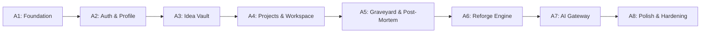

# Reforge — Implementation Roadmap & Task Breakdown

**Project:** Reforge (MVP)  
**Lifecycle Flow:** Capture → Shape → Build → Abandon → Reflect → Learn → Reforge  
**Architecture:** Flutter + Riverpod + Supabase  
**Status Legend:**  
- `[ ]` **TODO** (Not yet started)  
- `[-]` **IN_PROGRESS** (Currently undergoing development)  
- `[x]` **DONE** (Implemented, verified, and tested)

---

## Milestone Overview

---

## Phase A1: Foundation & Core Infrastructure
*Goal: Initialize Flutter dependencies, design tokens, error models, and Supabase client configuration.*

- [ ] **TASK-A1.1: Core Dependencies Configuration**
  - **Prerequisites:** Flutter SDK installed.
  - **Files:** `pubspec.yaml`
  - **Action:** Add `flutter_riverpod`, `supabase_flutter`, `go_router`, `lucide_icons`, `intl`, `flutter_dotenv`.
  - **DoD:** `flutter pub get` completes cleanly without version conflicts.

- [ ] **TASK-A1.2: Design Tokens & Theme Setup**
  - **Prerequisites:** TASK-A1.1
  - **Files:** `lib/core/theme/colors.dart`, `lib/core/theme/typography.dart`, `lib/core/theme/theme.dart`
  - **Action:** Implement Reforge color tokens (Graphite, Warm Surface, Forge Accent, Deep Slate), Inter typography styles, and Material 3 theme data.
  - **DoD:** Theme loads cleanly in light/dark modes.

- [ ] **TASK-A1.3: Error & Failure Architecture**
  - **Prerequisites:** TASK-A1.1
  - **Files:** `lib/core/errors/failures.dart`, `lib/core/errors/exceptions.dart`
  - **Action:** Create `AppFailure` abstract class with typed subclasses (`NetworkFailure`, `AuthFailure`, `NotFoundFailure`, `ServerFailure`).
  - **DoD:** Unit test verifying exception-to-failure mapping.

- [ ] **TASK-A1.4: Supabase Client & Environment Bootstrapping**
  - **Prerequisites:** TASK-A1.1
  - **Files:** `lib/core/network/supabase_client.dart`, `lib/main.dart`
  - **Action:** Initialize `Supabase.initialize` using `.env` credentials with error fallback.
  - **DoD:** App boots to shell without throwing unhandled exceptions.

---

## Phase A2: Authentication & Profile
*Goal: Secure user registration, login, session persistence, and profile creation.*

- [ ] **TASK-A2.1: Supabase Profiles Migration & RLS**
  - **Prerequisites:** Local Supabase setup.
  - **Files:** `supabase/migrations/20260926000001_create_profiles.sql`
  - **Action:** Create `profiles` table linked to `auth.users(id)` with auto-trigger on signup and RLS policies.
  - **DoD:** SQL migration applies cleanly via `supabase db reset`.

- [ ] **TASK-A2.2: Auth Repository & Data Source**
  - **Prerequisites:** TASK-A2.1
  - **Files:** `lib/features/auth/data/auth_repository.dart`
  - **Action:** Implement `signUp`, `signIn`, `signOut`, `getCurrentSession`, `getProfile`.
  - **DoD:** Mock unit tests verifying auth state emissions.

- [ ] **TASK-A2.3: Auth UI & Protected Routing**
  - **Prerequisites:** TASK-A2.2
  - **Files:** `lib/features/auth/presentation/login_screen.dart`, `lib/app/routes.dart`
  - **Action:** Implement Login & Signup screens adhering to design tokens. Configure `GoRouter` redirect guards for unauthenticated sessions.
  - **DoD:** Unauthenticated users are redirected to `/login`; authenticated users proceed to `/home`.

---

## Phase A3: Idea Vault
*Goal: Quick idea capture, tag categorization, search, and lifecycle status.*

- [ ] **TASK-A3.1: Ideas & Tags Database Migration**
  - **Prerequisites:** Phase A2
  - **Files:** `supabase/migrations/20260926000002_create_ideas_and_tags.sql`
  - **Action:** Define `ideas`, `tags`, and `idea_tags` tables with RLS and composite indexes.
  - **DoD:** RLS verified: User A cannot read or write User B's ideas.

- [ ] **TASK-A3.2: Ideas Repository & Notifier**
  - **Prerequisites:** TASK-A3.1
  - **Files:** `lib/features/ideas/data/ideas_repository.dart`, `lib/features/ideas/presentation/ideas_notifier.dart`
  - **Action:** Implement CRUD methods, tag association, and Riverpod `AsyncNotifier`.
  - **DoD:** Repository unit tests covering create, list, and archive.

- [ ] **TASK-A3.3: Idea Vault UI Surfaces**
  - **Prerequisites:** TASK-A3.2
  - **Files:** `lib/features/ideas/presentation/idea_vault_screen.dart`, `lib/features/ideas/presentation/idea_detail_screen.dart`
  - **Action:** Build ideas list with tag chips, quick-add floating action, and idea detail screen.
  - **DoD:** User can create an idea with tags in < 60 seconds; empty state renders when list is empty.

---

## Phase A4: Projects & Workspace
*Goal: Idea-to-project conversion, task checklist, and visible MVP boundaries.*

- [ ] **TASK-A4.1: Projects & Tasks Schema Migration**
  - **Prerequisites:** Phase A3
  - **Files:** `supabase/migrations/20260926000003_create_projects_and_tasks.sql`
  - **Action:** Create `projects` and `project_tasks` tables with RLS and status check constraints.
  - **DoD:** Tables created with cascade deletion for tasks upon project deletion.

- [ ] **TASK-A4.2: Atomic Conversion Stored Function (RPC)**
  - **Prerequisites:** TASK-A4.1
  - **Files:** `supabase/migrations/20260926000004_convert_idea_rpc.sql`
  - **Action:** Write `convert_idea_to_project(p_idea_id UUID)` PL/pgSQL function.
  - **DoD:** Conversion creates project and sets idea status to `converted` in a single atomic transaction.

- [ ] **TASK-A4.3: Project Workspace & Tasks UI**
  - **Prerequisites:** TASK-A4.2
  - **Files:** `lib/features/projects/presentation/project_workspace_screen.dart`
  - **Action:** Display prominent MVP Scope Banner, task checklist (add/toggle/delete), and status header.
  - **DoD:** Tasks can be added and toggled with immediate optimistic UI updates.

---

## Phase A5: Project Memory, Graveyard & Post-Mortem
*Goal: Real-time decision logging, deliberate abandonment flow, and post-mortem capture.*

- [ ] **TASK-A5.1: Memory, Post-Mortems & Lessons Migration**
  - **Prerequisites:** Phase A4
  - **Files:** `supabase/migrations/20260926000005_create_memory_and_postmortems.sql`
  - **Action:** Create `project_decisions`, `project_postmortems`, and `project_lessons` tables with RLS.
  - **DoD:** Database rejects post-mortem entry with duplicate `project_id`.

- [ ] **TASK-A5.2: Project Memory Logging UI**
  - **Prerequisites:** TASK-A5.1
  - **Files:** `lib/features/projects/presentation/project_memory_screen.dart`
  - **Action:** Build timeline UI displaying architectural decisions, blockers, and notes with quick-log action.
  - **DoD:** User can log a decision with rationale in 2 taps.

- [ ] **TASK-A5.3: Deliberate Abandonment Workflow**
  - **Prerequisites:** TASK-A5.1
  - **Files:** `lib/features/graveyard/presentation/abandon_dialog.dart`
  - **Action:** Implement modal capturing primary reason (Scope Creep, Blocker, etc.) and transition project status to `abandoned`.
  - **DoD:** Abandoned project moves out of active list into the Graveyard.

- [ ] **TASK-A5.4: Project Graveyard & Post-Mortem Screen**
  - **Prerequisites:** TASK-A5.3
  - **Files:** `lib/features/graveyard/presentation/graveyard_screen.dart`, `lib/features/postmortem/presentation/postmortem_screen.dart`
  - **Action:** Graveyard memorial list view + Post-mortem form capturing "What went wrong", "What went well", and reusable lessons.
  - **DoD:** Completed post-mortem saves reusable lessons to `project_lessons`.

---

## Phase A6: Reforge Engine & V2 Resurrection
*Goal: Resurrect abandoned projects into linked V2 projects carrying historical lessons.*

- [ ] **TASK-A6.1: Project Versions Lineage Migration**
  - **Prerequisites:** Phase A5
  - **Files:** `supabase/migrations/20260926000006_create_project_lineage.sql`
  - **Action:** Create `project_versions` table with `source_project_id != new_project_id` constraint and RLS.
  - **DoD:** Database prevents circular self-referential lineage.

- [ ] **TASK-A6.2: Reforge Repository & Resurrection Service**
  - **Prerequisites:** TASK-A6.1
  - **Files:** `lib/features/reforge/data/reforge_repository.dart`
  - **Action:** Implement logic to spawn V2 project, link version lineage, and copy forward selected lessons.
  - **DoD:** Unit tests verify V2 project links correctly to ancestor V1.

- [ ] **TASK-A6.3: Reforge Wizard UI**
  - **Prerequisites:** TASK-A6.2
  - **Files:** `lib/features/reforge/presentation/reforge_wizard_screen.dart`
  - **Action:** Guided 3-step wizard: (1) Review lessons, (2) Redefine tighter MVP scope, (3) Confirm and Forge V2.
  - **DoD:** Submitting wizard navigates user directly to newly created V2 Project Workspace with ancestor link badge.

---

## Phase A7: AI Gateway (Edge Functions)
*Goal: Server-side advisory AI integration with rate-limiting and fallback protection.*

- [ ] **TASK-A7.1: Edge Function: `ai_idea_review`**
  - **Prerequisites:** Supabase CLI
  - **Files:** `supabase/functions/ai_idea_review/index.ts`
  - **Action:** Create Deno Edge Function analyzing idea complexity and scope risks via LLM.
  - **DoD:** Function returns structured JSON `{ summary, risks, recommendedMvpCut }`.

- [ ] **TASK-A7.2: Edge Function: `ai_postmortem`**
  - **Prerequisites:** TASK-A7.1
  - **Files:** `supabase/functions/ai_postmortem/index.ts`
  - **Action:** Summarize project decisions and blockers into draft post-mortem.
  - **DoD:** Edge function successfully parses project history and returns lessons suggestions.

- [ ] **TASK-A7.3: Edge Function: `ai_reforge`**
  - **Prerequisites:** TASK-A7.1
  - **Files:** `supabase/functions/ai_reforge/index.ts`
  - **Action:** Propose V2 architectural simplifications grounded in past lessons.
  - **DoD:** Validated JSON response with 3 concrete simplification strategies.

- [ ] **TASK-A7.4: Flutter Client AI Gateway Service**
  - **Prerequisites:** TASK-A7.1-A7.3
  - **Files:** `lib/core/network/ai_gateway_service.dart`
  - **Action:** Call Edge Functions using Supabase Functions SDK with 15s timeout and non-blocking failure handler.
  - **DoD:** If AI call fails, app displays non-blocking toast and allows manual user entry.

---

## Phase A8: Hardening, Polish & Verification
*Goal: Static analysis, comprehensive test coverage, accessibility audit, and CI/CD.*

- [ ] **TASK-A8.1: Static Analysis & Lint Cleanliness**
  - **Prerequisites:** All previous phases.
  - **Files:** Entire repo
  - **Action:** Run `flutter analyze` and resolve all warnings.
  - **DoD:** Zero analysis issues reported.

- [ ] **TASK-A8.2: End-to-End Lifecycle Integration Test**
  - **Prerequisites:** TASK-A8.1
  - **Files:** `integration_test/lifecycle_test.dart`
  - **Action:** Automate full user journey: Signup → Idea → Project → Abandon → Post-Mortem → Reforge V2.
  - **DoD:** Test runs and passes in automated Flutter test runner.

- [ ] **TASK-A8.3: Accessibility (a11y) & Contrast Audit**
  - **Prerequisites:** TASK-A8.1
  - **Action:** Verify 48x48 dp touch targets and WCAG 2.1 AA color contrast across all screens.
  - **DoD:** Audit passes with no contrast or sizing violations.

- [ ] **TASK-A8.4: GitHub Actions CI Workflow**
  - **Prerequisites:** TASK-A8.1-A8.3
  - **Files:** `.github/workflows/ci.yml`
  - **Action:** Setup automated pipeline running `flutter analyze`, `flutter test`, and build verification on PRs.
  - **DoD:** CI pipeline triggers and succeeds on main branch.
